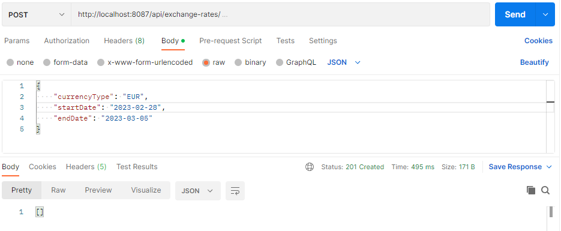
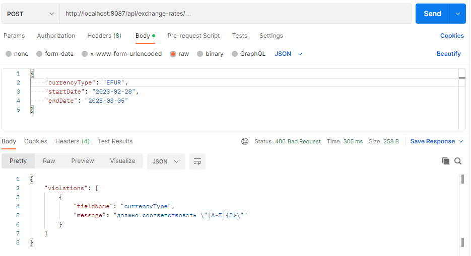
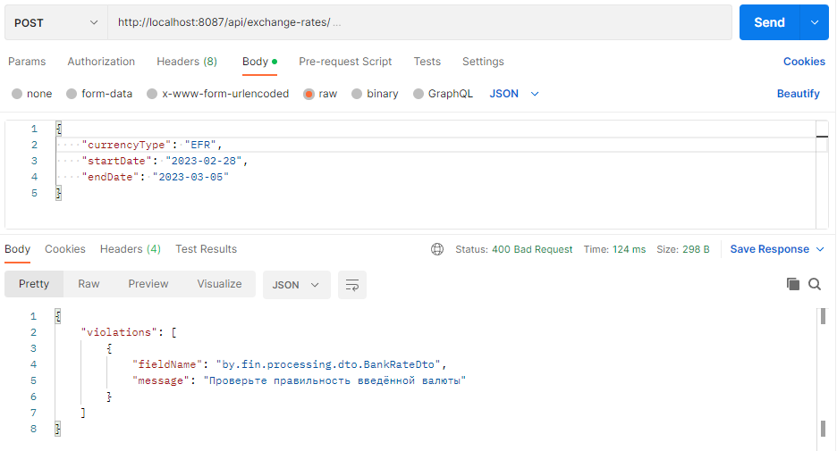
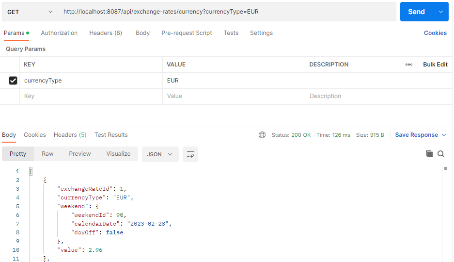
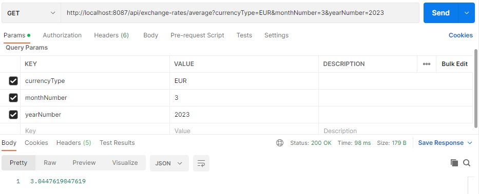
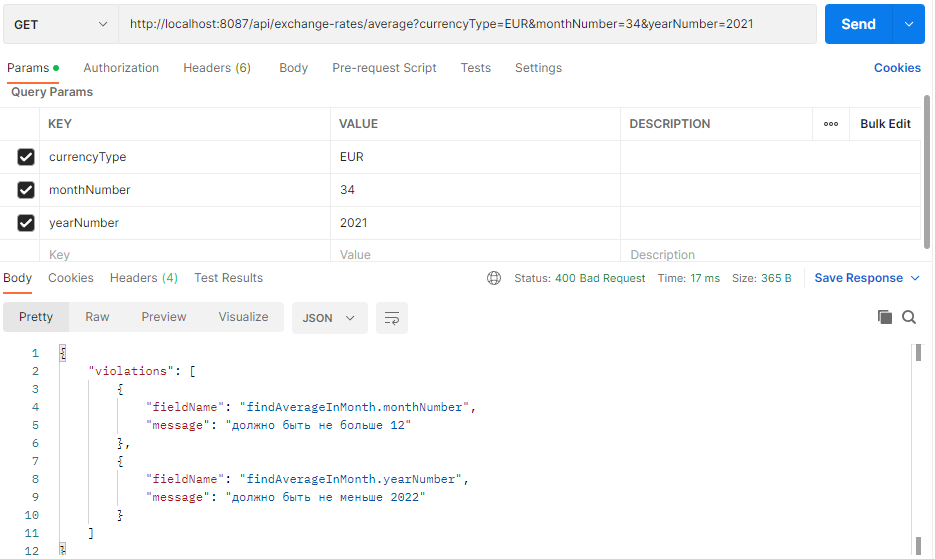

## Приложение для расчета среднего курса валют

### Введение:
Проект должен быть реализован с использованием паттерна MVC на основе предоставленного шаблона. Допускается изменять структуру шаблона, рефакторить и оптимизировать код.

Приложение должно иметь адреса запроса (описанных в функциональных требованиях), при обращении на которые будет выдавать JSON ответ с требуемой информацией.

Шаблон проекта использует уже настроенную H2 базу данных, рекомендуется использовать ее для хранения и взаимодействия с данными.

Приложение будет работать с курсами валют, которые публикует [НБ РБ](https://www.nbrb.by/statistics/rates/ratesdaily). 
Предполагается работа с курсами валют в диапазоне с 01.12.2022 по 31.05.2023. Приложение должно уметь: получать курсы через [API НБ РБ](https://www.nbrb.by/apihelp/exrates); выводить полученные курсы; рассчитывать средний курс за месяц.
### Функциональные требования:
1. Добавить ежедневные курсы валют за заданный период в БД. Пользователь указывает тип валюты (например USD), начальную и конечную дату периода. В качестве ответа получает массив курсов валют, которые были добавлены в БД.
   - Опционально: проверка на корректность дат;
   - Опционально: проверка есть ли уже в БД ежедневные курсы валют за выбранный период;
   - Опционально: проверка на корректность типа валюты.
3. Вывести все курсы по заданному типу валюты, имеющиеся в базе данных. Пользователь указывает тип валюты. В качестве ответа получает список курсов валют имеющихся в базе данных.
   - Опционально: проверка на корректность типа валюты.
4. Рассчитать средний курс за месяц. Пользователь указывает тип валюты и порядковый номер месяца. В качестве ответа получает рассчитанный средний курс за месяц.
      Средний курс = среднегеометрическое от ежедневных курсов за заданный месяц исключая выходные дни. Данная методология применяется Национальным Банком (подробнее ознакомиться с ней Вы сможете на сайте НБ РБ).

      Например: если в декабре было бы всего 4 дня (см. табл. 1), то средний курс составил бы 2,43332495337466
     
**табл. 1**

| Дата | Тип валюты | Курс | Выходной |
|:----------:|:----------:|:-------------:|:-----------------:|
| 01.12.2022 | USD | 2,4325 | Нет|
| 02.12.2022 | USD | 2,4336 |Нет|
| 03.12.2022 | USD | 2,4336 |Да |
| 04.12.2022 | USD | 2,4336 |Да |

Календарь выходных дней представлен в базе данных в таблице [WEEKENDS](https://github.com/amelenas/rpa_internship_2023/blob/master/web/src/main/resources/data.sql). Таблица заполняется при помощи файла “web/src/main/resources/data.sql”
 - Опционально: проверка месяца для расчета курса
 - Опционально: проверка на корректность типа валюты
 - Опционально: добавить возможность выбора года

### Результат:
Срок сдачи: **23.05.2023 12:00**

При возникновении недопониманий по бизнес-логике или реализации допускается интерпретировать эти спорные моменты на ваше усмотрение.

Если Вы будете делать свои допущения или интерпретации, опишите их в письме или комментарием в коде, чтобы мы могли учесть их при проверке.

Представление результата: выслать письмо на почту **dubrovskaya@fin.by** со ссылкой на ваш **публичный** репозиторий с решенным тестовым заданием.
- В репозитории с решением должен быть рабочий проект, который можно запустить после клонирования.
- В репозитории не должно быть лишних файлов, не задействованных в проекте.
- Допускается сдача неполного решения. Например, реализован 1 из трёх адресов запроса.

### Пример работы программы:

#### 1. Добавление ежедневных курсов за заданный период

Response сервера в случае полного совпадения периода и валюты при добавлении:

Response сервера в случае некорректного ввода параметров:

#### 2. Получение курсов валют из БД по заданому типу валюты

Проверка типа валюты происходит аналогичным образом, показанным выше

#### 3. Получение среднего значения курса валют из БД по заданому типу валюты и месяцу

Response сервера в случае отсутствия данных в указанный месяц:

Проверка типа валюты происходит аналогичным образом, показанным выше